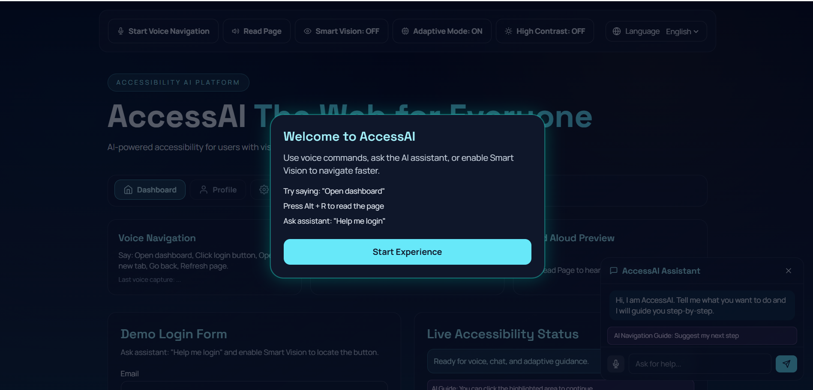
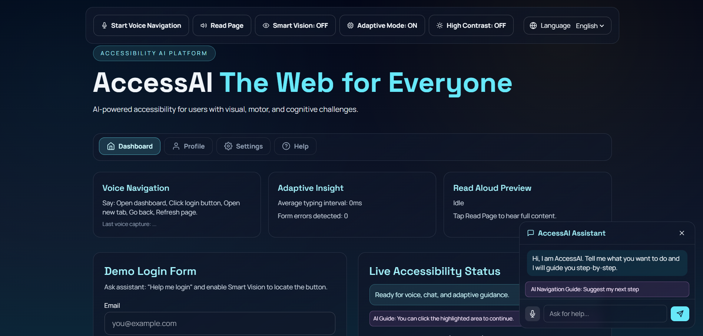
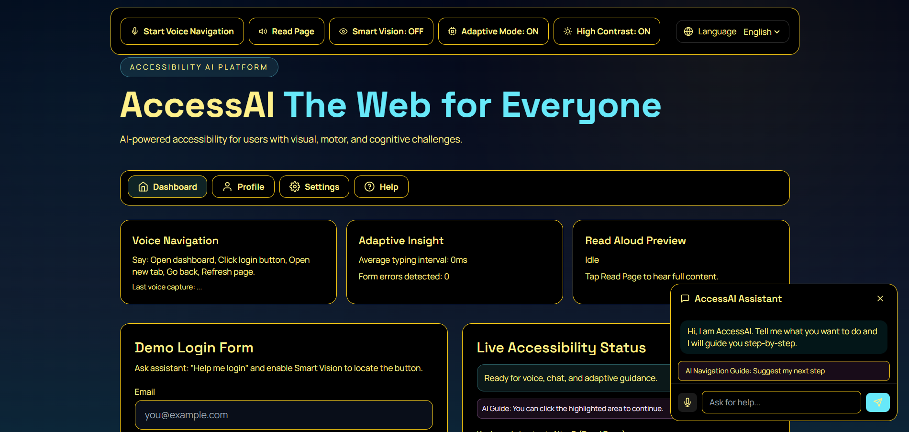

<div align="center">

# ♿ AccessaI — The Web for Everyone

### Turning every website into an inclusive, voice-first, AI-guided experience.

<br/>

[](https://reactjs.org/)
[](https://flask.palletsprojects.com/)
[](https://tailwindcss.com/)
[](https://openai.com/)
[](https://vitejs.dev/)

[](LICENSE)
[](https://github.com/Shaikh-Ibrahim-Mohammed-Rashid/AccessAI/pulls)
[]()
[]()

<br/>

> **AccessAI** is an AI-powered accessibility platform that empowers people with disabilities to navigate any website using voice commands, intelligent guidance, and adaptive UI — no special hardware required.

<br/>

[🚀 Live Demo](#-demo) · [📖 Docs](#-installation--setup) · [🐛 Report Bug](https://github.com/Shaikh-Ibrahim-Mohammed-Rashid/AccessAI/issues) · [✨ Request Feature](https://github.com/Shaikh-Ibrahim-Mohammed-Rashid/AccessAI/issues)

</div>

---

## 📋 Table of Contents

- [🌍 The Problem](#-the-problem)
- [💡 The Solution](#-the-solution)
- [✨ Features](#-features)
- [🎬 Demo](#-demo)
- [📸 Screenshots](#-screenshots)
- [🏗️ Architecture & Workflow](#️-architecture--workflow)
- [🛠️ Tech Stack](#️-tech-stack)
- [📁 Project Structure](#-project-structure)
- [⚙️ Installation & Setup](#️-installation--setup)
- [🚀 Usage Guide](#-usage-guide)
- [🔌 API Reference](#-api-reference)
- [🔮 Future Enhancements](#-future-enhancements)
- [👥 Team](#-team)
- [📄 License](#-license)

---

## 🌍 The Problem

Over **1 billion people** live with some form of disability — yet the modern web is largely built without them in mind.

| User Group | Common Barrier |
|---|---|
| 👁️ Vision Impairment | Cannot scan page layouts, buttons, or interactive controls |
| 🖐️ Motor Impairment | Mouse-heavy navigation is painful or impossible |
| 👴 Elderly Users | Need larger text, guided flow, and simpler layouts |
| 🧠 Cognitive Challenges | Overwhelmed by complex interfaces without step-by-step support |

Current accessibility solutions are mostly static toggles — they don't adapt, don't converse, and don't guide. **AccessAI changes that.**

---

## 💡 The Solution

AccessAI is a full-stack web platform that layers AI intelligence directly on top of any web interface. It combines:

- 🎙️ **Real-time voice navigation** for hands-free control
- 🔊 **Text-to-speech** that reads any page aloud on demand
- 🤖 **Conversational AI assistant** for contextual, step-by-step guidance
- 👁️ **Smart Vision overlays** that spotlight interactive elements
- 🔄 **Adaptive UI** that automatically adjusts based on observed user behavior

This isn't just compliance — it's genuine digital inclusion.

---

## ✨ Features

### 🎙️ 1. Voice Navigation System
Hands-free browsing via the browser's Web Speech API. Speak naturally and the page responds.

**Supported commands include:**
| Command | Action |
|---|---|
| `"Open dashboard"` | Navigate to dashboard view |
| `"Scroll down"` / `"Scroll up"` | Page scrolling |
| `"Read this page"` | Triggers full TTS read |
| `"Stop reading"` | Halts speech playback |
| `"Toggle contrast"` | Switches high-contrast mode |
| `"Help me login"` | Launches AI login assistant |

---

### 🔊 2. Text-to-Speech (TTS)
One click or voice command reads your entire page aloud using browser-native speech synthesis, pre-processed by the backend for clean chunked delivery. Supports **English and Hindi**.

---

### 🤖 3. AI Assistant (Chat + Voice)
A floating panel powered by GPT-4o-mini that accepts both typed and spoken queries. It can:
- Explain what's on the current page
- Walk users through multi-step tasks
- Respond to requests like *"Help me fill out this form"*

---

### 👁️ 4. Smart Vision Mode
Scans the live DOM, identifies key interactive elements (buttons, forms, nav links), and overlays visual guidance tooltips — turning cluttered UIs into guided experiences.

---

### 🔄 5. Adaptive Accessibility Mode
Monitors user behavior in real time:
- Detects **slow typing** or **repeated login errors**
- Automatically **suggests voice-first workflows**
- Switches to **simplified visual mode** with larger, high-legibility controls

---

### ♿ 6. Additional Accessibility Features
- 🌐 **Multi-language support** — English & Hindi
- ⌨️ **Keyboard shortcuts:**
  - `Alt + R` — Read page
  - `Alt + V` — Voice navigation
  - `Alt + C` — Contrast mode
- 🟡 **High contrast mode** (black/yellow) for maximum visibility
- 🎓 **Onboarding tutorial** popup for first-time users

---

## 🎬 Demo

> 📹 **Video Demo:** [Watch on YouTube](#) 

**Recommended demo flow for judges:**

1. Load the app and observe the onboarding tutorial
2. Say **"Open dashboard"** — voice navigation fires
3. Say **"Scroll down"** — command-based scroll
4. Click **Read Page** or say **"Read this page"** — TTS begins
5. Open the AI assistant and type **"Help me login"**
6. Enable **Smart Vision** — watch form elements get highlighted
7. Enter invalid credentials twice — **Adaptive Mode** activates
8. Switch to **Hindi** — repeat TTS and voice commands
9. Toggle **High Contrast Mode**

---

## 📸 Screenshots


| Home / Landing | AI Assistant |
|---|---|
|  |  |

| High Contrast Mode |
|---|
|  |

---

## 🏗️ Architecture & Workflow

```
┌─────────────────────────────────────────────────────────┐
│                      User (Browser)                     │
│                                                         │
│  ┌───────────────┐    ┌──────────────────────────────┐  │
│  │  Voice Input  │───▶│   Web Speech API (STT)       │  │
│  └───────────────┘    └─────────────┬────────────────┘  │
│                                     │                   │
│                            Intent Mapping               │
│                                     │                   │
│              ┌──────────────────────▼───────────────┐   │
│              │         React Frontend (Vite)        │   │
│              │  - Smart Vision DOM Scanner          │   │
│              │  - Adaptive Behavior Monitor         │   │
│              │  - TTS Playback (SpeechSynthesis)    │   │
│              └────────┬──────────────┬──────────────┘   │
└───────────────────────│──────────────│──────────────────┘
                        │              │
              POST /chat│    POST /tts │
                        ▼              ▼
              ┌──────────────────────────────┐
              │       Flask Backend          │
              │  - Chat endpoint             │
              │  - TTS preprocessing         │
              │  - OpenAI SDK integration    │
              └──────────────┬───────────────┘
                             │
                             ▼
                  ┌─────────────────────┐
                  │   OpenAI API        │
                  │   (gpt-4o-mini)     │
                  └─────────────────────┘
```

**Request Lifecycle:**
1. User speaks a command or types a query
2. Frontend maps speech → intent → UI action
3. For AI queries, page context + message sent to `/chat`
4. For TTS, page text sent to `/tts` for chunking, then played back
5. Smart Vision scans DOM and renders overlay guidance
6. Adaptive mode watches behavior and adjusts the UI automatically

---

## 🛠️ Tech Stack

| Layer | Technology |
|---|---|
| **Frontend Framework** | React.js (Vite) |
| **Styling** | Tailwind CSS |
| **Animation** | Framer Motion |
| **HTTP Client** | Axios |
| **Speech (STT + TTS)** | Browser Web Speech API |
| **Backend** | Flask + Flask-CORS |
| **AI Model** | OpenAI `gpt-4o-mini` |
| **Environment Config** | python-dotenv |

---

## 📁 Project Structure

```
AccessAI/
├── backend/
│   ├── app.py                  # Flask server — /chat and /tts endpoints
│   ├── requirements.txt
│   └── .env.example
│
├── frontend/
│   ├── src/
│   │   ├── components/         # UI components (Assistant, SmartVision, etc.)
│   │   ├── hooks/              # Custom React hooks
│   │   ├── utils/              # Intent mapping, helpers
│   │   ├── App.jsx
│   │   ├── index.css
│   │   └── main.jsx
│   ├── .env.example
│   ├── tailwind.config.js
│   ├── postcss.config.js
│   └── package.json
│
├── docs/
│   └── screenshots/
└── README.md
```

---

## ⚙️ Installation & Setup

### Prerequisites

- **Node.js** v20+
- **Python** 3.10+
- An **OpenAI API key** ([get one here](https://platform.openai.com/api-keys))

---

### 1. Clone the Repository

```bash
git clone https://github.com/Shaikh-Ibrahim-Mohammed-Rashid/AccessAI.git
cd AccessAI
```

---

### 2. Backend Setup

```bash
cd backend

# Create and activate virtual environment
python -m venv ../.venv
../.venv/Scripts/activate        # Windows
# source ../.venv/bin/activate   # macOS / Linux

# Install dependencies
pip install -r requirements.txt

# Configure environment
copy .env.example .env           # Windows
# cp .env.example .env           # macOS / Linux
```

Edit `.env` and add your credentials:

```env
OPENAI_API_KEY=your_openai_api_key_here
OPENAI_MODEL=gpt-4o-mini
FLASK_PORT=5000
```

Start the backend:

```bash
python app.py
```

> Backend runs at `http://localhost:5000`

---

### 3. Frontend Setup

Open a **new terminal tab/window:**

```bash
cd frontend

npm install

copy .env.example .env           # Windows
# cp .env.example .env           # macOS / Linux

npm run dev
```

> Frontend runs at `http://localhost:5173`

---

## 🚀 Usage Guide

Once both servers are running, open `http://localhost:5173` in your browser.

| Feature | How to Activate |
|---|---|
| 🎙️ Voice Navigation | Click **"Enable Voice"** or press `Alt + V`, then speak a command |
| 🔊 Read Page | Click **"Read Page"** or press `Alt + R` |
| 🤖 AI Assistant | Click the floating assistant icon → type or speak your question |
| 👁️ Smart Vision | Toggle **"Smart Vision"** in the toolbar |
| 🟡 High Contrast | Click **"Contrast"** or press `Alt + C` |
| 🌐 Switch Language | Use the language selector for English / Hindi |

> **Tip:** On first load, an onboarding tutorial walks you through all major features.

---

## 🔌 API Reference

### `POST /chat`

Sends a user message with optional page context to get AI-powered guidance.

**Request:**
```json
{
  "message": "Help me login",
  "history": [],
  "pageContext": "Title: Login Page | Elements: email input, password input, submit button"
}
```

**Response:**
```json
{
  "reply": "Sure! Here's how to log in step-by-step: 1. Click the Email field..."
}
```

---

### `POST /tts`

Preprocesses page content into speech-ready chunks for browser TTS playback.

**Request:**
```json
{
  "text": "Welcome to AccessAI. This platform helps you navigate...",
  "lang": "en-US"
}
```

**Response:**
```json
{
  "text": "Welcome to AccessAI...",
  "lang": "en-US",
  "chunks": ["Welcome to AccessAI.", "This platform helps you navigate..."],
  "note": "Client should use Web Speech API for playback."
}
```

---

## 🔮 Future Enhancements

- 🌐 **Browser Extension** — deploy AccessAI as an overlay on any public website
- 🏛️ **Government Portal Integration** — partner with civic tech for inclusive e-governance
- 🎓 **Education Platform Layer** — inclusive e-learning support for students with disabilities
- 🏦 **Secure Form Guidance** — banking-friendly, step-by-step secure form completion
- 🗣️ **Regional Language Expansion** — support for Hindi, Tamil, Bengali, and more
- 📷 **OCR + Image Captioning** — make visual content accessible through description
- 👤 **User Profiles** — save personalized accessibility preferences across sessions

---

## 👥 Team

<table>
  <tr>
    <td align="center">
      <b>Shaikh Ibrahim Mohammed Rashid</b><br/>
      🏆 Lead Developer<br/>
      <a href="https://github.com/Shaikh-Ibrahim-Mohammed-Rashid">@Shaikh-Ibrahim-Mohammed-Rashid</a>
    </td>
  </tr>
</table>

**Team Name:** `The DOMinators`

---

## 🌟 Impact Statement

> *"Accessibility is not a feature — it is a foundation."*

AccessAI makes the web genuinely usable for people who are currently excluded from it. By fusing real-time AI with practical accessibility actions — voice, vision, adaptation — it doesn't just satisfy compliance checklists. It restores **independence**, **dignity**, and **digital participation** to users who deserve it most.

Whether deployed as a standalone platform or extended as a browser layer, AccessAI has a clear path to real-world impact at scale.

---

## 📄 License

This project is licensed under the **MIT License** — see the [LICENSE](LICENSE) file for details.

---

<div align="center">

Made with ❤️ by **The DOMinators**

⭐ Star this repo if you believe the web should work for everyone.

</div>
